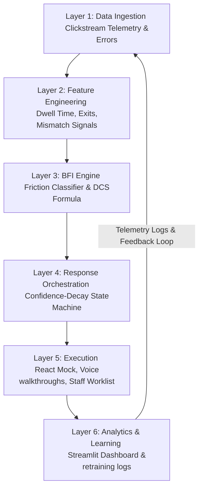

# Saarthi BFI Platform (Behavioral Friction Intelligence)

> **"Most banks measure digital adoption by the number of customers who downloaded the app. Saarthi measures it by the number who stopped being afraid to use it."**
> 
> *Built for SBI @ Global Fintech Fest (GFF) Hackathon 2026 — Track 2: Digital Adoption.*

Saarthi is a state-of-the-art **Behavioral Friction Intelligence (BFI) Platform** designed for State Bank of India's YONO 2.0 digital banking ecosystem. Instead of bombarding customers with generic notifications or static banners, Saarthi monitors user interaction telemetry in real-time, classifies specific digital friction categories, updates a dynamic **Digital Confidence Score (DCS)**, and deploys precise, compliance-aligned interventions.

---

## 🚀 Core Pillars of Saarthi

1. **Digital Confidence Score (DCS)**: A per-customer index (0 to 100) quantifying digital comfort and feature exploration confidence, rather than mere transactional volume.
2. **Real-time Friction Classification**: Distinguishes user confusion, hesitation, language barriers, and technical roadblocks into 4 distinct gap categories.
3. **Adaptive Intervention Engine (State Machine)**: Triggers the optimal resolution channel (e.g., Mode 1 contextual guides, Mode 2 BHASHINI-powered multilingual voice walkthroughs, Mode 3 tactical silence, or Mode 4 branch staff callbacks) without generating notification fatigue.
4. **Seamless Branch Callback Triage**: Automatically populates priority callback lists for SBI's 10,000+ digital-support executives, transforming blind outbound calls into smart, pre-contextualized support.

---

## 🛠️ Architecture & System Design

Saarthi follows a **Six-Layer Architecture with a Continuous Learning Loop** to align with RBI's Jan/Apr 2026 digital banking and AI governance directives:



### 1. Friction Taxonomy & Response Map

| Gap Type | Signal Pattern | Root Cause | Resolution Mode |
| :--- | :--- | :--- | :--- |
| **Awareness Gap** | Zero screen visits; no search attempts; zero dwell. | Feature is undiscovered in the user's mental model. | **Mode 1**: Contextual in-app card at peak relevance. |
| **Confidence Gap** | Visited 2+ times; dwell > 15s; exited before transaction. | Trust deficit: user fears irreversible financial mistakes. | **Mode 2**: Voice-first walkthrough with reversible micro-actions. |
| **Language Gap** | Rapid back-navigation; low dwell; mismatch signals. | UI text language mismatch / literacy barrier. | **Mode 2 (BHASHINI)**: Automatic voice switch to preferred language. |
| **Access Gap** | Telemetry logs errors or connection timeouts. | Technical, mandate, or auth blockers (e.g., KYC lapse). | **Mode 4**: Immediate escalation to branch staff queue. |

### 2. DCS Composition Formula
The composite score is calculated using four weighted components:
*   **Feature Breadth Score (30%)**: Unique product categories explored / total available features (UPI, Recurring Deposit, Mutual Funds, Insurance, Balance Check).
*   **Completion Rate (30%)**: Ratio of completed transactions to initiated feature sessions over a rolling window.
*   **Hesitation Decay Index (25%)**: Inverse of user hesitate-then-exit events (dwell time > 15 seconds without action completion).
*   **Return Rate (15%)**: Rate at which users return to an abandoned feature within 7 days.

$$DCS = 0.30 \times Breadth + 0.30 \times Completion + 0.25 \times HesitationDecay + 0.15 \times ReturnRate$$

#### DCS Score Bands & System Behaviors:
*   **0 – 20 (Dormant)**: Passive balance-check users. Mode 1 enabled (frequency capped to 1 per session).
*   **21 – 45 (Cautious)**: Exploring but exiting. Mode 2 interactive voice walkthroughs triggered.
*   **46 – 70 (Developing)**: Habituating across 2–3 features. Interventions back off for already-attempted tasks.
*   **71 – 90 (Confident)**: Self-sufficient. Active passive monitoring (silence mode).
*   **91 – 100 (Advocate)**: Power users. Platform remains silent; used as cohorts' benchmark.

---

## 💻 Tech Stack & Repository Structure

*   **Frontend**: React, Vite, CSS, standard Lucide icons, simulating a premium YONO 2.0 banking interface.
*   **Backend**: FastAPI, SQLAlchemy (SQLite DB), scikit-learn (explainable Decision Tree classifier), and Faker (synthetic telemetry engine).
*   **Analytics Dashboard**: Streamlit, Plotly, Pandas, simulating executive metrics and live callback queues.

### Folder Structure
```bash
Saarthi/
├── backend/
│   ├── app/
│   │   ├── classifier.py      # Explainable rule & ML classifier
│   │   ├── data_gen.py        # Generates realistic session clickstreams
│   │   ├── database.py        # SQLite model initialization
│   │   ├── dcs_calculator.py  # Computes DCS math & bands
│   │   ├── main.py            # FastAPI service endpoints
│   │   ├── models.py          # SQLAlchemy schema definition
│   │   └── state_machine.py   # User-intervention frequency & mode capping
│   ├── saarthi_bfi.db         # Local SQLite DB
│   └── requirements.txt       # Python backend dependencies
├── dashboard/
│   ├── app.py                 # Streamlit application
│   └── requirements.txt       # Dashboard python dependencies
└── frontend/                  # React Vite YONO 2.0 Mock App
```

---

## ⚡ Setup & Installation

### 1. Prerequisites
*   Node.js (v18+)
*   Python (3.9+)

### 2. Backend Setup
Navigate to the root directory and set up the Python backend:
```bash
# Install backend requirements
pip install -r backend/requirements.txt

# Start the FastAPI server (runs on http://127.0.0.1:8000)
python -m uvicorn backend.app.main:app --reload
```
*The database (`backend/saarthi_bfi.db`) will initialize automatically on startup and seed 100 mock users.*

### 3. Dashboard Setup
Open a new terminal to run the Streamlit dashboard:
```bash
# Install dashboard requirements
pip install -r dashboard/requirements.txt

# Launch the dashboard (runs on http://localhost:8501)
streamlit run dashboard/app.py
```

### 4. Frontend Setup
Open another terminal to run the YONO 2.0 Web Application Mock:
```bash
# Navigate to the frontend directory
cd frontend

# Install dependencies
npm install

# Run the frontend in dev mode (runs on http://localhost:5173)
npm run dev
```

---

## 🛡️ Regulatory Compliance (RBI Jan/Apr 2026 Guidelines)
Saarthi is architected with compliance as a first-class feature:
*   **Explainable Classifier**: Decision Tree splits and rule evaluation criteria are logged step-by-step for audit trails.
*   **GAICA-Ready Audit Trail**: An encrypted, immutable audit log records the user, session state, triggered mode, and corresponding DCS delta.
*   **Privacy-First Telemetry**: User identifiers are pseudonymized; no financial PII (passwords, complete pins) is tracked in the telemetry layer.
*   **Multilingual Trust (BHASHINI)**: Integrated with Bhashini APIs (ASR/TTS) to ensure vernacular support is structurally embedded, matching the Government of India's public sector fintech initiatives.
